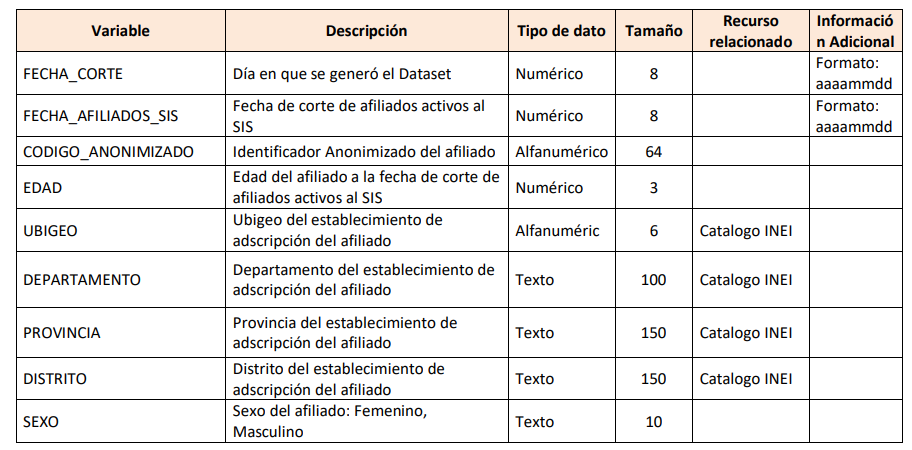
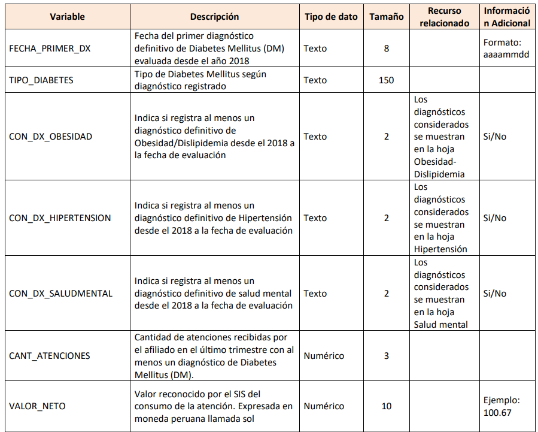
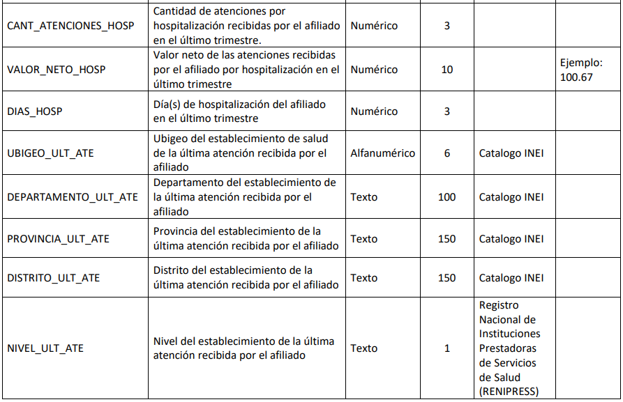

# Datathon:
## Inteligencia Artificial (IA) y datos abiertos del SIS 2024
Es un concurso organizado por el Seguro Integral de Salud (SIS) y la Pontificia Universidad Católica del Perú (PUCP) con el apoyo de la Secretaría de Gobierno y Transformación Digital de la Presidencia del Consejo de Ministros (PCM)

## Objetivo
Analizar la situación estadística de enfermedades como la **diabetes mellitus e hipertensión arterial**, que afectan a miles de peruanos y personas en el mundo.   

## ¿Que buscamos?
- *Promover soluciones basadas en datos* utilizando machine learning e inteligencia artificial para abordar problemas de salud pública en el Perú.
- *Identificar modelos predictivos* para la prevención y prevalencia de enfermedades crónicas como la diabetes mellitus (DM) y la hipertensión arterial (HTA)
- *Fomentar un entorno colaborativo* de investigación entre los diferentes grupos científicos, investigadores y estudiantes del país enfocados en aplicaciones de inteligencia artificial en salud.

## Plaraforma de Datos abiertos
- [Datos abiertos del SIS](https://www.datosabiertos.gob.pe/group/seguro-integral-de-salud-sis?fbclid=IwZXh0bgNhZW0CMTAAAR2oJgvEoiOBCefCcCwKvJJh7a3xRRlJHgAMkxZZUXdaqAQlA3B9NB5fJaE_aem_ATb_lLrKW4GthQYtEnF9e73mw9_BNMBvXWmHHRPPFTnYWTbhLPJHzefeLe3TLxoJp8yD_X-rLe9pOBrPnuiNwh3_)

## Tipos de Solucion 
Se sugieren cuatro salidas “outcomes”, las cuales no son limitativas, el equipo puede presentar otras salidas o soluciones siempre ligadas a los datos abiertos publicados por el SIS, la cual puede ser usada conjuntamente con otros datasets: 

- **Outcome de Fallecimiento**, el cual tiene como objetivo estimar el impacto de la asociación de pacientes con diabetes confirmada o repetida con otras variables, ello permitirá revelar dichas variables y prever acciones futuras de intervenciones en salud pública.
- **Outcome de Esperanza de vida**, el cual tiene como objetivo describir y pronosticar las posibles variables asociadas a la mayor o menor esperanza de vida, como son el sexo,edad, trazadores basados en la lista de comorbilidades de Mary Charlson y su índice de comorbilidad.
- **Outcome de Complicación**, el cual tiene por objetivo segmentar poblaciones donde las intervenciones en el primer nivel de atención podrían brindarse en la población con menor complicación, dejando el espacio a la población con complicaciones para que se atiendan en los hospitales de mayor complejidad.
- **Outcome de seguimiento del paciente**, cuya finalidad es determinar hasta qué punto se ha conseguido equilibrar la glucosa e impedir las complicaciones. El seguimiento se hace con la hemoglobina glicosilada (HbA1c) y/o Glucemia. Se estima que el 62% de pacientes diabéticos están descompensados, así en estos pacientes el riesgo de complicaciones es más elevado.
- **Outcome identificación de factores de riesgo (Diabetes-Mellitus, HTA, etc.)** con el objetivo que proponer políticas de prevención primaria que combatan esos factores.
- Cualquier otra solución que consideren potencial y relevante.
## Informacion adicional
- Cada grupo registrado entregará evidencias resaltantes desde el punto de vista geográfico,epidemiológico, costos, tipo de atenciones de salud, correlación salud-ambiente, alcance de medicamentos, seguimiento, complicaciones, etc. usando métodos de Machine Learning o IA. El grupo con mejores evidencias, calificado por un grupo de expertos, será el ganador.
## Trama de parametros de la base de datos del SIS 
### Tabla 1:

### Tabla 2:

### Tabla 3:

# Dataset usado ahora Afiliados_activos_DM_SIS.csv 
## Que es un Outcome?
En el contexto de Data Science, un outcome es el resultado deseado o el objetivo que se busca alcanzar a partir del análisis de los datos. Los outcomes son las respuestas que quieres obtener o las predicciones que deseas hacer a partir de tus datos. En tu caso, los outcomes son las distintas soluciones o predicciones que puedes obtener al analizar el dataset sobre pacientes con diabetes, como la complicación, la esperanza de vida, o la identificación de factores de riesgo.

## Pasos de un Proyecto de Data Science
### Definición del problema
- **Objetivo:** Comprender qué preguntas o problemas necesitas resolver. Esto define los outcomes o resultados que esperas obtener.
### Recolección de datos
- **Objetivo:** Obtener los datos necesarios para abordar el problema. Puede implicar la búsqueda de datasets relevantes o la recopilación de datos nuevos.
### Exploración de los datos (EDA - Exploratory Data Analysis)
- **Objetivo:** Comprender los datos mediante visualización y estadísticas. Implica verificar si hay datos faltantes, qué variables pueden ser útiles y cómo se distribuyen.
- **Herramientas:** pandas, matplotlib, seaborn para realizar gráficos, estadísticas descriptivas, y detectar patrones.
### Preprocesamiento de los datos
- **Objetivo:** Limpiar y transformar los datos para prepararlos para el modelado. Aquí se manejan los datos faltantes, se convierten variables categóricas en numéricas, y se normalizan los datos si es necesario.
### Selección y creación de modelos
- **Objetivo:** Elegir modelos estadísticos o de aprendizaje automático para abordar el problema. El tipo de modelo depende de si el outcome es una clasificación, regresión, o predicción de series temporales.
### Entrenamiento y validación del modelo
- **Objetivo:** Entrenar el modelo usando una parte del dataset (set de entrenamiento) y luego validarlo usando otro conjunto (set de validación o testing) para medir su rendimiento.
- **Herramientas:** scikit-learn es útil para dividir los datos en sets de entrenamiento y testing y para ajustar el modelo.
### Evaluación del modelo 
- **Objetivo:** Medir la efectividad del modelo con métricas adecuadas, como precisión, exactitud, sensibilidad, o el coeficiente de determinación (R^2), según el tipo de problema
### Optimización del modelo
- **Objetivo:** Mejorar el rendimiento del modelo ajustando hiperparámetros o probando diferentes algoritmos.
### Interpretación y comunicación de resultados
- **Objetivo:** Interpretar los resultados obtenidos y comunicar de manera clara qué significan los outcomes. Esto puede implicar la creación de informes o visualizaciones comprensibles.
### Implementación y despliegue
- **Objetivo:** Integrar el modelo en un sistema que pueda ser utilizado en la práctica, ya sea como una aplicación, un dashboard o un API.
### Mantenimiento y mejora continua
- **Objetivo:** Monitorear el desempeño del modelo en el tiempo y actualizarlo conforme se obtengan nuevos datos o cambien las condiciones.

# Outcome de Compilacion
## Objetivo:
Segmentar a los pacientes según el riesgo de complicaciones, basado en:
- **Comorbilidades:** CON_DX_OBESIDAD, CON_DX_HIPERTENSION, CON_DX_SALUDMENTAL.
- **Atenciones médicas:** CANT_ATENCIONES.
- **Hospitalizaciones:** CANT_ATENCIONES_HOSP, DIAS_HOSP.
## Pasos:
1. **Preprocesar los Datos:**
- Asegúrate de que las variables de comorbilidades estén correctamente codificadas (si son object, conviértelas en variables binarias 0 y 1).
2. **Segmentacion:**
- Puedes crear un score de riesgo basado en las comorbilidades y hospitalizaciones. Por ejemplo, un modelo simple donde asignas un valor a cada variable (mayor puntaje indica mayor riesgo).
3. **Agrupamiento:**
- Segmenta a los pacientes según su nivel de riesgo (KMeans es una opción)
# Outcome de Esperanza de vida
## Objetivo:
Estimar cómo variables como edad, sexo, y comorbilidades afectan la esperanza de vida.
## Pasos:
1. **Preprocesar las variables:**
- Estimar cómo variables como edad, sexo, y comorbilidades afectan la esperanza de vida.
2. **Modelo Predictivo:**
- Puedes usar un modelo de regresión lineal o logística para predecir el impacto de estas variables en un proxy de esperanza de vida (si no tienes un target directo, el número de atenciones hospitalarias puede ser un buen indicador de salud a largo plazo).
3. **Análisis de los coeficientes:**
- Examina los coeficientes del modelo para identificar cómo las variables influyen en el resultado.
# Outcome de Identificación de Factores de Riesgo
## Objetivo:
Identificar qué combinaciones de comorbilidades y otras características (edad, sexo, hospitalizaciones) están asociadas con un mayor riesgo de complicaciones.
## Pasos:
1. **Análisis de Correlacion:**
- Comienza con una matriz de correlación para entender qué variables tienen relaciones significativas con hospitalizaciones o atenciones.
2. **Modelo predictivo:**
- Utiliza un modelo de clasificación (por ejemplo, un árbol de decisión o regresión logística) para identificar los factores de riesgo más relevantes.
3. **Visualización:**
- Visualiza los factores de riesgo más importantes con gráficos (puedes usar matplotlib o seaborn).

